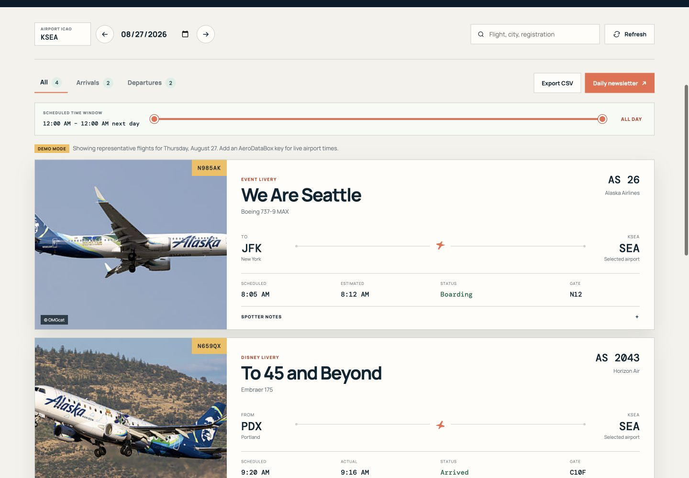

<p align="center">
  
</p>

<p align="center"><strong>Find the special paint before it reaches the gate.</strong></p>

<p align="center">
  
  
  
</p>

<p align="center">
  <a href="#quick-start">Quick start</a> ·
  <a href="#see-it-in-action">Preview</a> ·
  <a href="docs/ARCHITECTURE.md">Architecture</a> ·
  <a href="docs/CONTRIBUTING.md">Contribute</a>
</p>

Livery Watch finds special-livery arrivals and departures by matching airport schedules to a curated aircraft-registration watchlist. Use the browser dashboard for interactive searches or generate a standalone daily HTML newsletter.

## See it in action

<p align="center">
  
</p>

> The preview uses the built-in KSEA demo schedule. With an AeroDataBox key, the same interface uses live airport movements and registration data.

## Highlights

- Tracks 369 verified aircraft registrations across airlines serving Seattle.
- Searches any airport using its four-character ICAO code.
- Filters arrivals and departures by direction, search text, and scheduled-time range.
- Shows flight details, registration, livery evidence, and aircraft photography.
- Exports filtered CSV data and a standalone daily HTML newsletter.

## Quick start

### Requirements

- Node.js 20 or newer
- `npm`, included with Node.js
- An AeroDataBox API key for live schedules

Check Node and npm:

```bash
node --version
npm --version
```

There are no package dependencies to install.

### Start the app

```bash
git clone https://github.com/ddxxdd-code/airplane-special-livery-tracker.git
cd airplane-special-livery-tracker
npm start
```

Open [http://localhost:4173](http://localhost:4173).

Without an API key, the app starts in clearly marked demo mode. Demo flights are available only for KSEA and are not current operations.

## Enable live data

1. Get an AeroDataBox key through RapidAPI.
2. Create your private environment file:

```bash
cp .env.example .env
```

3. Add the key to `.env`:

```dotenv
AERODATABOX_API_KEY=your_real_key_here
AERODATABOX_API_HOST=aerodatabox.p.rapidapi.com
LIVERY_WATCH_CONTACT_URL=https://example.com/contact
PORT=4173
```

4. Stop the server with `Control-C`, then run `npm start` again.

The key stays on the local server and `.env` is excluded from Git. For step-by-step RapidAPI instructions, verification, GitHub Actions, and key-rotation guidance, read [Create and protect an AeroDataBox API key](docs/API_KEY_SETUP.md).

## Search an airport

1. Enter a four-character ICAO airport code.
2. Choose a date.
3. Press **Refresh**.

Examples:

| Airport | ICAO code |
| --- | --- |
| Seattle | `KSEA` |
| Boston | `KBOS` |
| Los Angeles | `KLAX` |
| London Heathrow | `EGLL` |
| Tokyo Haneda | `RJTT` |

Use `KBOS`, not the three-letter IATA code `BOS`. The watchlist covers the current passenger airlines serving Seattle plus requested Alaska/Hawaiian affiliates. Other airports can still be searched, but airlines that do not serve Seattle may need registrations added.

## Filter and export flights

- Choose **All**, **Arrivals**, or **Departures**.
- Drag both ends of the scheduled-time slider to select a time period.
- Search by flight, city, airline, registration, or livery.
- Press **Export CSV** to save the visible filtered rows.
- Press **Daily newsletter** to download the visible filtered rows as HTML.
- Press **tracked liveries** at the top of the page to inspect the watchlist.

Times are shown in the selected airport’s local wall-clock time.

## Generate a daily newsletter

Use a date followed by a four-character ICAO code:

```bash
npm run newsletter -- 2026-08-26 KSEA
npm run newsletter -- 2026-08-26 KBOS
```

The files are saved as:

```text
generated/livery-watch-KSEA-2026-08-26.html
generated/livery-watch-KBOS-2026-08-26.html
```

Open a generated file in a browser to use its arrival/departure and time-range controls. Email clients may remove JavaScript, so the controls are hidden there and all matching rows remain visible.

The command-line newsletter contains every match for the chosen airport/date. To export only selected filters, use the dashboard’s **Daily newsletter** button instead.

## Get tomorrow’s list

Replace the example date and airport with tomorrow’s values:

```bash
npm run newsletter -- YYYY-MM-DD KSEA
```

Future registrations are often missing or changed by the airline. Generate once for planning, then refresh or regenerate closer to flight time for better coverage.

## Understand zero or incorrect matches

Zero matches means that no registration returned by AeroDataBox matched the current watchlist. It does not prove that no special-livery aircraft will operate.

Possible causes:

- A future flight does not have a registration yet.
- The airline changed the assigned aircraft.
- The provider’s future registration is stale.
- The special aircraft is missing from the local watchlist.
- The selected airport/date is wrong.
- An old generated HTML snapshot is still open.

The **live** label means AeroDataBox answered the request; it does not guarantee every future tail assignment is complete or authoritative. Refresh closer to departure and confirm important movements with the airline or airport.

## Add a special livery

Edit `data/special-liveries.json` and add an entry:

```json
{
  "registration": "N123AB",
  "name": "Example special livery",
  "airline": "Example Air",
  "aircraftType": "Boeing 737-8",
  "category": "Commemorative",
  "colors": ["#123456", "#abcdef"],
  "verifiedOn": "2026-08-26",
  "sourceUrl": "https://airline.example/press-release",
  "note": "Why this aircraft is special."
}
```

The Seattle carrier audit and its maintenance method are documented in [docs/WATCHLIST_AUDIT.md](docs/WATCHLIST_AUDIT.md).

Use a reliable evidence link and recheck the paint status periodically. Then run:

```bash
npm test
```

## Troubleshooting

### `zsh: command not found: npm`

Install the current Node.js LTS release, open a new Terminal window, and check `node --version` and `npm --version`.

### `EADDRINUSE: address already in use :::4173`

Another process already uses port 4173. Use the running app, stop its Terminal process with `Control-C`, or choose another port:

```bash
PORT=4174 npm start
```

Then open [http://localhost:4174](http://localhost:4174).

### The page still says Demo mode

- Confirm the file is named exactly `.env` in the project root.
- Confirm the variable is exactly `AERODATABOX_API_KEY`.
- Remove spaces or quotation marks around the key.
- Restart the server after changing `.env`.
- Check the Terminal for a `401`, `403`, or `429` provider error.

### A different airport shows no results

Confirm the four-character ICAO code appears in both the page and generated filename. A valid airport can still show zero when registrations are unavailable or its special aircraft are not yet in the watchlist.

## More documentation

- [API key setup and security](docs/API_KEY_SETUP.md)
- [Architecture and data flow](docs/ARCHITECTURE.md)
- [How to contribute](docs/CONTRIBUTING.md)
- [Documentation index](docs/README.md)
