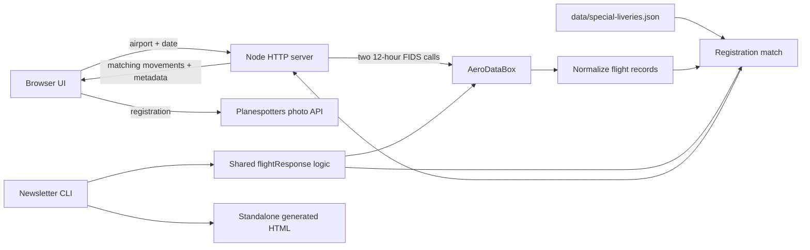

# Architecture

## Design goal

Livery Watch produces a small, auditable list of special-livery airport movements. Flight providers usually do not offer a dependable “special livery” field, so the application joins an airport schedule to a curated list of aircraft registrations.

It deliberately does not scrape Flightradar24 or JetTip.

## System overview



## Components

| Component | Responsibility |
| --- | --- |
| `server.mjs` | Loads environment variables, serves static assets, calls providers, exposes JSON endpoints, and applies demo fallback behavior. |
| `lib/airport.mjs` | Validates four-character ICAO codes and formats airport-local times. |
| `lib/flights.mjs` | Normalizes AeroDataBox records, normalizes registrations, de-duplicates movements, and matches the watchlist. |
| `data/special-liveries.json` | Human-maintained source of truth for special-livery registrations and evidence links. |
| `data/demo-flights.json` | Representative KSEA-only data for local testing without a key. |
| `public/app.js` | Browser state, API loading, rendering, photo hydration, filters, and exports. |
| `public/filters.js` | Pure scheduled-time filtering and formatting helpers shared by the UI and newsletter generator. |
| `scripts/generate-newsletter.mjs` | CLI entry point and standalone HTML renderer. |
| `test/` | Node test-runner coverage for airport, filtering, matching, and server behavior. |

## Airport schedule flow

1. The client supplies a date and four-character ICAO airport code.
2. `server.mjs` validates both values.
3. The server queries the AeroDataBox FIDS time-range endpoint sequentially for `00:00–12:00` and `12:00–23:59`. Sequential calls respect the Basic plan’s one-request-per-second rate.
4. Each provider record is normalized into the internal flight shape.
5. Registrations are uppercased and stripped of spaces and punctuation.
6. Only registrations present in `data/special-liveries.json` are retained.
7. Duplicate movement IDs are removed and results are ordered by scheduled local time.
8. The response includes matches, the registry, and metadata such as provider mode, airport, total movements, and generation time.

One full-day load normally makes two Tier 2 requests. A `429` response is retried once per half-day window, so the maximum is four HTTP attempts. Adding registrations to the local watchlist does not increase AeroDataBox usage.

## Internal flight shape

```js
{
  id,
  direction,       // "arrival" or "departure"
  flightNumber,
  airline,
  airport,         // opposite endpoint
  scheduled,
  estimated,
  actual,
  status,
  terminal,
  gate,
  registration,
  aircraftType,
  livery           // matched registry object
}
```

Provider time strings are intentionally preserved instead of converted through the machine timezone. The UI and newsletter display their airport-local wall-clock portion.

## HTTP endpoints

| Method and path | Result |
| --- | --- |
| `GET /api/flights?airport=KSEA&date=YYYY-MM-DD` | Matched flights, complete watchlist, and provider metadata. |
| `GET /api/photo/:registration` | First available Planespotters thumbnail, source link, and attribution; cached in memory for 12 hours. |
| `GET /api/health` | Server health and whether an AeroDataBox key is configured. |
| `GET /*` | Static files from `public/`. |

Provider failures fall back to clearly labeled demo data only for KSEA. Other airports return an empty demo result with a warning instead of showing Seattle data under the wrong airport.

## Browser filters and exports

The browser retains the fetched matches in memory. Direction, text, and scheduled-time filters are applied locally and make no additional AeroDataBox calls. CSV and browser-generated HTML exports contain only visible filtered rows.

The CLI generator calls the shared `flightResponse` function, includes all matches, and writes `generated/livery-watch-ICAO-YYYY-MM-DD.html`. Its filters are progressive enhancement: browser JavaScript reveals them, while email clients that strip JavaScript see every row.

## Photo handling

The browser requests photos after flight cards render. The server queries the Planespotters public photo endpoint with a descriptive User-Agent, returns attribution, and uses a 12-hour in-memory cache. Photo failures do not block flight results; the local SVG remains visible.

## Data limitations

- Future schedules often lack registrations until the airline assigns an aircraft.
- A published future registration may still reflect an earlier rotation and change later.
- Zero matches means no returned registration matched the current registry, not that no special livery will operate.
- Registration-based matching cannot detect an unlisted livery or a recently repainted aircraft.
- AeroDataBox “live” means a current provider response, not airline-authoritative future tail assignment.
- Demo data is synthetic/representative and KSEA-only.
- Open ADS-B data is valuable once an aircraft is broadcasting but does not provide a complete future passenger timetable.

## Security boundaries

- Secrets stay in server-side environment variables.
- Static files under `public/` and generated HTML must never contain provider credentials.
- `.env` and local variants are excluded by `.gitignore`; `.env.example` contains names and safe placeholders only.
- User-supplied airport codes are validated before use.
- Static file resolution is constrained to the public directory.
- HTML produced from provider and registry values is escaped before insertion.

See [API key setup](API_KEY_SETUP.md) for key storage and rotation.
